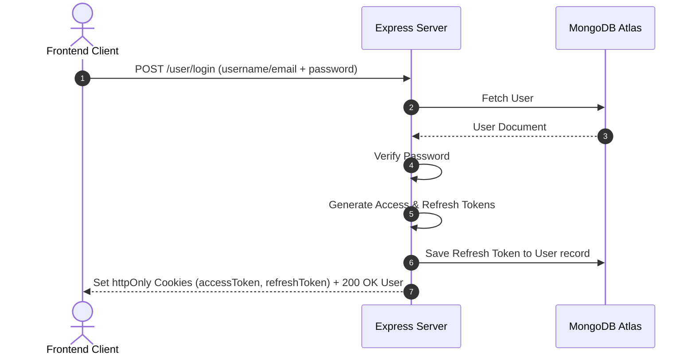

# Authentication & Session Architecture

Visual-Tube implements a secure, stateless **Double-Token JWT (JSON Web Token) Authentication** flow using `httpOnly` secure cookies. This approach prevents client-side scripts from reading tokens, protecting sessions from Cross-Site Scripting (XSS) attacks.

---

## 1. The Token Architecture

* **Access Token**: Short-lived token (default: 1 day) used to authenticate API requests. Contains the user's basic ID, username, and email.
* **Refresh Token**: Long-lived token (default: 10 days) stored in the database. Used to request a new access token when the current one expires.

```
+--------------------------------------------------------------+
|                    JWT Session Tokens                        |
+------------------------------+-------------------------------+
|         Access Token         |         Refresh Token         |
+------------------------------+-------------------------------+
|  • Lifespan: 1 Day           |  • Lifespan: 10 Days          |
|  • Purpose: Request Auth     |  • Purpose: Token Re-auth     |
|  • Storage: Cookies          |  • Storage: DB + Cookies      |
+------------------------------+-------------------------------+
```

---

## 2. Authentication Workflow



### 2.1 User Registration (`POST /api/v1/user/register`)
1. Multer intercepts request, parses user avatar and optional cover images, and uploads files to Cloudinary.
2. User details (email, username, fullname, password) are validated.
3. Password is encrypted using `bcrypt` (10 salt rounds) via the User schema's pre-save hook.
4. User document is created in MongoDB. Returns status `201 Created` without returning password or refresh token.

### 2.2 User Login (`POST /api/v1/user/login`)
1. Frontend submits either `username` or `email` along with `password`.
2. Backend queries the database using `$or` to find matching user.
3. Password is verified using `bcrypt.compare()`.
4. Server generates both tokens using `jwt.sign()`.
5. The `refreshToken` is saved on the user's database record to allow verification/revocation.
6. Tokens are attached to the response via `res.cookie` headers:
   * **Security Options**: `httpOnly: true`, `secure: true` (only HTTPS), `sameSite: "none"` (for cross-origin requests).
7. Returns status `200 OK` with user details.

### 2.3 Token Regeneration (`POST /api/v1/user/regenerate-tokens`)
When the short-lived `accessToken` expires:
1. The frontend client automatically intercepts the expired token request, then requests token regeneration.
2. The server extracts the `refreshToken` from incoming cookies (`req.cookies.refreshToken`).
3. The server decodes the token using the secret `REFRESH_TOKEN_SECRET` and queries the database for the user.
4. The server compares the cookie's refresh token against the saved `refreshToken` on the user record.
5. If valid, the server signs a new `accessToken` and `refreshToken`, updates the database record, sets the updated cookies, and returns the tokens.

### 2.4 User Logout (`POST /api/v1/user/logout`)
1. The middleware extracts the authenticated user from the access token.
2. The server clears the `refreshToken` field on the user's record in the database.
3. The cookies are cleared using `res.clearCookie` on both `accessToken` and `refreshToken`.
4. Returns status `200 OK`.

---

## 3. Route Authentication Middleware (`verifyJwt`)

Every protected API route is intercepted by the `verifyJwt` middleware:
1. Extracts token from `req.cookies.accessToken` or the `Authorization` header (`Bearer <token>`).
2. Verifies signature using `jwt.verify` and `ACCESS_TOKEN_SECRET`.
3. Queries database to fetch user details (excluding password and refresh token).
4. Appends the user object to the request (`req.user = user`).
5. Calls `next()` to pass control to the controller.
