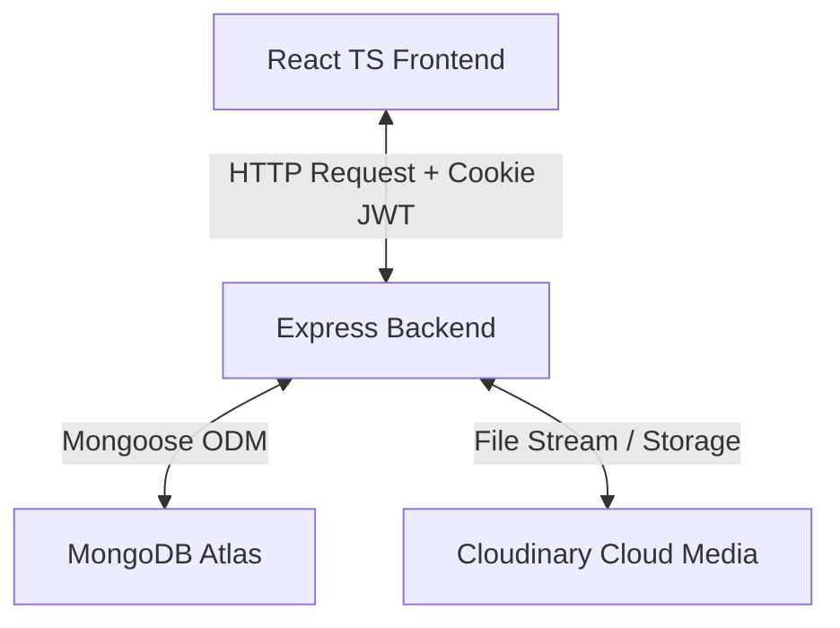
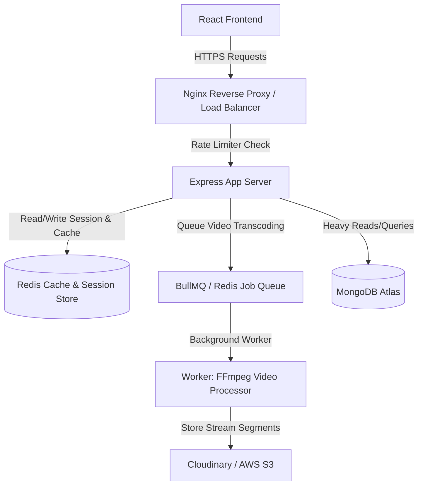

# Visual-Tube: Full-Stack Video Sharing Platform

Visual-Tube is a high-performance, responsive, full-stack video-sharing application designed to mimic core functionalities of YouTube. The project is built using a modern decoupled architecture consisting of a React TypeScript Single Page Application (SPA) frontend and a Node.js Express backend API, powered by a MongoDB database.

---

## 1. Project Overview

Visual-Tube allows users to upload videos, create and manage playlists, customize channel profiles, subscribe to other creators, write comments, like videos/comments, and track watch history. The platform incorporates premium modern design elements such as sleek dark-themed layouts, glassmorphism, responsive grids, micro-interactions, and visual feedback states.

### Core Stack
* **Frontend**: React 19, TypeScript, Vite, Tailwind CSS, TanStack React Query (v5), React Router DOM (v7), Framer Motion, and Lucide Icons.
* **Backend**: Node.js, Express, Mongoose (MongoDB), Multer, JWT, and Cloudinary.
* **Database**: MongoDB Atlas.

---

## 2. Full-Stack Architecture



### 2.1 Frontend Architecture
The frontend is organized using a **Feature-Based Folder Structure**. Each feature contains its own pages, components, and custom hooks to maintain modularity.
* **State Management & Caching**: Powered by **TanStack React Query**. API states are cached, auto-invalidated, and refetched in the background, providing instantaneous UI updates.
* **Routing**: Managed by React Router v7 with dynamic code-splitting via `React.lazy()` for all route entrypoints to optimize bundle sizes.
* **Layout System**: The app uses shared structures like `AppLayout` (with collapsible Sidebar and Header) and `AuthLayout` (for user registration/login screens).

### 2.2 Backend Architecture
The backend is a state-of-the-art RESTful API structured around standard MVC design patterns:
* **Routers**: Direct incoming HTTP requests to corresponding middleware and controllers.
* **Middleware**: Handles user authentication checks (`verifyJwt`), file uploads (`multer` disk parser), and error serializations.
* **Controllers**: House business logic, query calculations, and database modifications.
* **Models**: Define collection schemas, relational bounds, and schema hook validators.

---

## 3. Core Feature Workflows

The application features are structured in a logical operational sequence:

```
  1. Authentication (Register/Login) 
       ▼
  2. Video Management (Upload/Edit)
       ▼
  3. Video Playback & Interaction (Likes/Watch tracking)
       ▼
  4. Engagement (Comments/Subscriptions)
       ▼
  5. Content Curation (Playlists/Watch History)
```

1. **Authentication & Session Security**:
   Users register and login via credentials. The server generates an Access Token and a Refresh Token, delivering them securely to the browser in `httpOnly` secure cookies. Submissions can use username or email.
2. **Video Uploading & Control**:
   Creators can upload videos (up to 100MB) with descriptions, custom tags, and thumbnails. Videos can be toggled between Public (published) or Private (unpublished) states, and thumbnails can be swapped dynamically.
3. **Frictionless Playback & Interactions**:
   Video detail pages render views count, like metrics, and uploader profiles. Real-time liking/unliking is supported on both videos and individual comments.
4. **Subscriptions & Comments**:
   Viewers can subscribe to channels. Comment sections support instant posting, comment editing, deleting, and paginated infinite scrolls.
5. **Curation (Playlists & History)**:
   Users create playlists, add or remove videos from playlists, and automatically track watch history (logged once 20% of a video is completed).

---

## 4. Setup and Installation

This project is split into a **backend** API service (Express/Node.js) and a **frontend** client application (React/TypeScript). Both folders need to be configured separately.

### 4.1 Prerequisites
Before you start, make sure you have the following installed:
* **Node.js** (v18.x or later recommended)
* **npm** (comes with Node.js) or **Yarn**
* **MongoDB Atlas** account or a local MongoDB database instance
* **Cloudinary** account (for video and image asset storage)
* **Docker / Docker Compose** (optional, recommended for running Redis easily) or a local **Redis** instance

---

### 4.2 Backend Setup

1. **Navigate to the backend directory**:
   ```bash
   cd backend
   ```

2. **Install dependencies**:
   ```bash
   npm install
   ```

3. **Configure Environment Variables**:
   Create a `.env` file in the `backend` directory by copying the `.env.sample`:
   ```bash
   cp .env.sample .env
   ```
   Open the `.env` file and populate it with your credentials:
   ```env
   PORT=8000
   MONGODB_URI=your_mongodb_connection_string
   CORS_ORIGIN=http://localhost:5173

   # Note: Ensure the spelling matches "REFERESH" as required by the backend models
   ACCESS_TOKEN_SECRET=your_access_token_secret
   ACCESS_TOKEN_EXPIRY=1d
   REFERESH_TOKEN_SECRET=your_refresh_token_secret
   REFERESH_TOKEN_EXPIRY=10d

   CLOUDINARY_CLOUD_NAME=your_cloudinary_cloud_name
   CLOUDINARY_API_KEY=your_cloudinary_api_key
   CLOUDINARY_API_SECRET=your_cloudinary_api_secret

   # Redis configuration
   REDIS_URL=redis://localhost:6379
   ```

4. **Start the Redis Server**:
   The backend uses Redis for session tracking and caching. If you have Docker installed, you can start the Redis container using the provided `docker-compose.yml` file:
   ```bash
   docker compose up -d
   ```
   Otherwise, start your local Redis instance on port `6379`.

5. **Start the Backend Server**:
   ```bash
   npm run start
   ```
   The backend API will start running at `http://localhost:8000`.

---

### 4.3 Database Seeding (Optional but Recommended)

Visual-Tube includes a production-grade database seeding framework to populate the database with realistic mock data (users, creators, videos, likes, comments, subscriptions, etc.) for testing.

To run the seeding script:
1. Ensure the backend `.env` variables (`MONGODB_URI` and Cloudinary keys) are fully configured.
2. Run the seeding command from the `backend/` directory:
   ```bash
   npm run seed -- --clear
   ```
   > [!NOTE]
   > The `--clear` flag will wipe existing MongoDB collections in correct dependency order and purge Cloudinary files under `visual-tube/seed/` before seeding new mock data.
   > The seeder runs in batches to prevent local disk overflow, and outputs reports inside `.seed-workspace/reports/`.

---

### 4.4 Frontend Setup

1. **Navigate to the frontend directory**:
   ```bash
   cd ../frontend
   ```

2. **Install dependencies**:
   ```bash
   npm install
   ```

3. **Configure Environment Variables**:
   Create a `.env` file in the `frontend` directory by copying the `.env.example`:
   ```bash
   cp .env.example .env
   ```
   Configure the API base URL to point to the running backend service:
   ```env
   VITE_API_BASE_URL=http://localhost:8000/api/v1
   ```

4. **Start the Frontend Development Server**:
   ```bash
   npm run dev
   ```
   Open your browser and navigate to `http://localhost:5173` (or the port specified by Vite) to view the application.

---

## 5. Future Production Roadmap & Architecture

As the application scales, moving from a functional Node/Express/MongoDB monolith to a production-grade system requires focusing on resource constraints, concurrency, and fault tolerance.

Below is the proposed next-step architecture and roadmap for scaling Visual-Tube.

### 5.1 Scaled System Architecture



### 5.2 Implementation Phases

#### Phase 1: Hardening the Monolith (Core Primitives)
Focus on this first. Over-engineering a project into microservices too early adds immense networking and operational overhead. Master these primitives within a monolith first.

* **Rate Limiting**:
  - Implement token bucket/sliding window algorithms using `express-rate-limit` (Redis-backed).
  - Apply to `/api/v1/users/login` and `/api/v1/users/register` routes to prevent brute-force attacks.
  - Implement stricter rate limiting on video uploads and commenting to prevent spam.
* **Caching (Redis)**:
  - **Homepage Feed / Recommendations**: Cache expensive MongoDB aggregations in Redis for 5 minutes.
  - **Uploader Profile/Subscribers**: Cache channel profile info; invalidate only when the creator uploads a new video or changes their avatar.
  - **User Sessions**: Store JWT blocklists or active sessions in Redis instead of querying MongoDB or decoding JWTs statelessly on every request.
* **Reverse Proxy & Load Balancing (Nginx)**:
  - Configure Nginx to proxy port `80` (HTTP) or `443` (HTTPS) requests to your Node app running on port `8000`.
  - Configure Nginx to serve the frontend's static assets (`/dist` folder) directly.

#### Phase 2: Asynchronous Systems & Video Processing
A video sharing platform's biggest challenge is handling heavy, long-running tasks like upload processing and encoding.

* **Background Jobs & Message Queues (BullMQ / Redis)**:
  - Offload long-running tasks to background worker processes.
  - **Improvement**: Upload raw video to temp disk storage, immediately push a `"process-video"` job to BullMQ, and return `202 Accepted` to the client. A background worker will handle Cloudinary uploading, processing, and database updates.
* **Modern Video Streaming (FFmpeg, HLS/DASH)**:
  - Write a background worker script running `ffmpeg` to transcode uploaded `.mp4` videos into multiple resolution profiles (360p, 720p, 1080p) and generate `.m3u8` playlist files.
  - Host segments on Cloudinary/AWS S3 and play them using an HLS player (e.g., `video.js` or `hls.js`) in the React frontend.

#### Phase 3: Transition to Microservices (When to Split)
Only adopt microservices when you need to scale teams, deploy parts of the system independently, or isolate resource-heavy operations.

* **Communication Protocol**: Use synchronous communication (gRPC, HTTP/REST) and asynchronous communication (RabbitMQ or Apache Kafka message brokers).
* **Service Discovery & API Gateway**: Direct external clients to internal microservices routing under a single entry point.
* **Microservices Split**:
  - **Service A (Auth/User Core)**: Handle login, playlists, and subscriptions (light CPU).
  - **Service B (Video Transcoder)**: Consume upload jobs from a RabbitMQ/Kafka queue and run transcoding on GPU-heavy servers.

