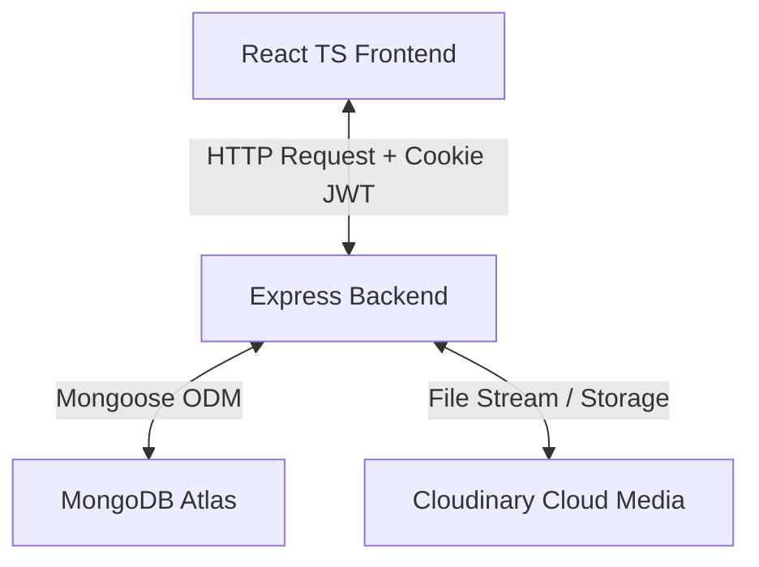

# Visual-Tube: Full-Stack Video Sharing Platform

Visual-Tube is a high-performance, responsive, full-stack video-sharing application designed to mimic core functionalities of YouTube. The project is built using a modern decoupled architecture consisting of a React TypeScript Single Page Application (SPA) frontend and a Node.js Express backend API, powered by a MongoDB database.

---

## 1. Project Overview

Visual-Tube allows users to upload videos, create and manage playlists, customize channel profiles, subscribe to other creators, write comments, like videos/comments, and track watch history. The platform incorporates premium modern design elements such as sleek dark-themed layouts, glassmorphism, responsive grids, micro-interactions, and visual feedback states.

### Core Stack
* **Frontend**: React 19, TypeScript, Vite, Tailwind CSS, TanStack React Query (v5), React Router DOM (v7), Framer Motion, and Lucide Icons.
* **Backend**: Node.js, Express, Mongoose (MongoDB), Multer, JWT, and Cloudinary.
* **Database**: MongoDB Atlas.

---

## 2. Full-Stack Architecture



### 2.1 Frontend Architecture
The frontend is organized using a **Feature-Based Folder Structure**. Each feature contains its own pages, components, and custom hooks to maintain modularity.
* **State Management & Caching**: Powered by **TanStack React Query**. API states are cached, auto-invalidated, and refetched in the background, providing instantaneous UI updates.
* **Routing**: Managed by React Router v7 with dynamic code-splitting via `React.lazy()` for all route entrypoints to optimize bundle sizes.
* **Layout System**: The app uses shared structures like `AppLayout` (with collapsible Sidebar and Header) and `AuthLayout` (for user registration/login screens).

### 2.2 Backend Architecture
The backend is a state-of-the-art RESTful API structured around standard MVC design patterns:
* **Routers**: Direct incoming HTTP requests to corresponding middleware and controllers.
* **Middleware**: Handles user authentication checks (`verifyJwt`), file uploads (`multer` disk parser), and error serializations.
* **Controllers**: House business logic, query calculations, and database modifications.
* **Models**: Define collection schemas, relational bounds, and schema hook validators.

---

## 3. Core Feature Workflows

The application features are structured in a logical operational sequence:

```
  1. Authentication (Register/Login) 
       ▼
  2. Video Management (Upload/Edit)
       ▼
  3. Video Playback & Interaction (Likes/Watch tracking)
       ▼
  4. Engagement (Comments/Subscriptions)
       ▼
  5. Content Curation (Playlists/Watch History)
```

1. **Authentication & Session Security**:
   Users register and login via credentials. The server generates an Access Token and a Refresh Token, delivering them securely to the browser in `httpOnly` secure cookies. Submissions can use username or email.
2. **Video Uploading & Control**:
   Creators can upload videos (up to 100MB) with descriptions, custom tags, and thumbnails. Videos can be toggled between Public (published) or Private (unpublished) states, and thumbnails can be swapped dynamically.
3. **Frictionless Playback & Interactions**:
   Video detail pages render views count, like metrics, and uploader profiles. Real-time liking/unliking is supported on both videos and individual comments.
4. **Subscriptions & Comments**:
   Viewers can subscribe to channels. Comment sections support instant posting, comment editing, deleting, and paginated infinite scrolls.
5. **Curation (Playlists & History)**:
   Users create playlists, add or remove videos from playlists, and automatically track watch history (logged once 20% of a video is completed).
