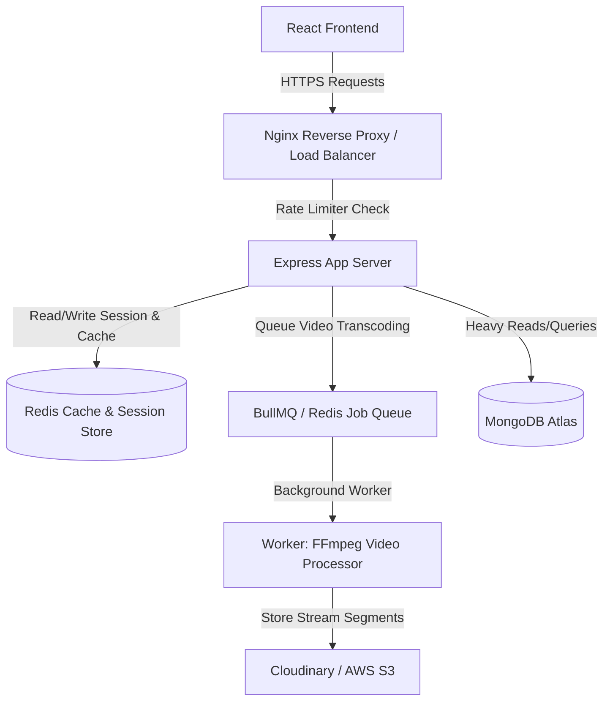

# The Next-Step Backend Roadmap: Hardening & Scalability

Congratulations on building Visual-Tube! Moving from a functional Node/Express/MongoDB setup to a production-grade system requires changing how you think about **resource constraints**, **concurrency**, and **fault tolerance**.

Here is a curated learning path designed to take your backend skills to the next level, along with exactly how to apply each concept to improve your current project.

---

## 🗺️ Architectural Roadmap

Below is a diagram of how these production concepts (Nginx, Redis, rate limiting, and queues) overlay onto your existing Visual-Tube system:

---

## 📍 Phase 1: Hardening the Monolith (Core Primitives)
*Focus on this first. Over-engineering a project into microservices too early adds immense networking and operational overhead. Master these primitives within a monolith first.*

### 1. Rate Limiting
* **What it is**: Controlling the rate of traffic sent by a client to prevent denial-of-service (DoS) attacks, brute-force hacking, and API resource abuse.
* **What to learn**: Token bucket algorithm, sliding window log, and libraries like `express-rate-limit` (memory-based) vs. Redis-backed rate limiters (cluster-safe).
* **How to apply to Visual-Tube**:
  - Add rate limiting to your `/api/v1/users/login` and `/api/v1/users/register` routes to prevent brute-force attacks.
  - Implement a stricter rate limit on your video upload and commenting endpoints to prevent spamming.

### 2. Caching (Redis)
* **What it is**: Storing frequently accessed, slowly changing data in an ultra-fast in-memory database to bypass expensive database queries.
* **What to learn**: Cache invalidation strategies (Write-Through, Cache-Aside), TTL (Time-To-Live), and cache stampede prevention.
* **How to apply to Visual-Tube**:
  - **Homepage Feed / Recommendations**: Computing the personalized video feed via MongoDB aggregation pipelines on every page load is expensive. Cache the resulting video array in Redis for 5 minutes.
  - **Uploader Profile/Subscribers**: Cache channel profile info. Invalidate the cache only when the creator uploads a new video or changes their avatar.
  - **User Sessions**: Store JWT blocklists or active sessions in Redis instead of querying MongoDB or decoding JWTs statelessly on every single request.

### 3. Reverse Proxy & Load Balancing (Nginx)
* **What it is**: A high-performance web server that sits in front of your application, routing traffic, terminating SSL certificates, and distributing requests across multiple instances of your Node app.
* **What to learn**: Reverse proxying, upstream configuration, load balancing algorithms (Round Robin, Least Connections), and Gzip compression.
* **How to apply to Visual-Tube**:
  - Set up Nginx locally or on a VPS to proxy requests on port `80` (HTTP) or `443` (HTTPS) to your Node app running on port `8000`.
  - Configure Nginx to serve your frontend's static assets (`/dist` folder) directly. Node is notoriously slow at serving static files; Nginx is built for it.

---

## 📍 Phase 2: Asynchronous Systems & Video Processing
*A video sharing platform's biggest challenge is handling heavy, long-running tasks like upload processing and encoding.*

### 1. Background Jobs & Message Queues (BullMQ / Redis)
* **What it is**: Offloading long-running tasks to background worker processes so that your Express API can respond to the user immediately, rather than blocking the main event loop.
* **What to learn**: Producer-consumer pattern, job states (waiting, active, delayed, failed), and retry mechanisms.
* **How to apply to Visual-Tube**:
  - Right now, when a user uploads a video, your server uploads it directly to Cloudinary and waits. If the connection drops or the file is large, the request timeouts.
  - **Improvement**: Upload the raw file to temporary disk storage, immediately push a `"process-video"` job to a BullMQ queue, and return a `202 Accepted` response to the user with a job ID. A background worker picks up the job, uploads it to Cloudinary/S3, and updates the database state to "Processed" when done.

### 2. Modern Video Streaming (FFmpeg, HLS/DASH)
* **What it is**: Splitting videos into small chunks (segments) at multiple resolutions (360p, 720p, 1080p) so the player can dynamically adjust quality depending on the user's internet speed (like YouTube does).
* **What to learn**: Adaptive Bitrate Streaming (ABR), HTTP Live Streaming (HLS), and utilizing FFmpeg CLI inside Node.
* **How to apply to Visual-Tube**:
  - Write a background worker script that runs `ffmpeg` to take an uploaded `.mp4` video, transcode it into 360p, 720p, and 1080p profiles, and generate an `.m3u8` playlist file.
  - Host these segments and playlist files on Cloudinary/AWS S3 and play them using an HLS player library (like `video.js` or `hls.js`) in your React frontend.

---

## 📍 Phase 3: Transition to Microservices (When to Split)
*Only adopt microservices when you need to scale teams, deploy parts of the system independently, or isolate resource-heavy operations.*

### 1. What to Learn
* **Communication Protocol**: Synchronous communication (gRPC, HTTP/REST) vs. Asynchronous communication (Message Brokers like RabbitMQ or Apache Kafka).
* **Service Discovery & API Gateway**: Directing external clients to internal microservices routing under a single entry point.

### 2. How to apply to Visual-Tube
* In a monolithic setup, if a user uploads a large video, the transcoding CPU load will slow down the login, search, and watch pages for all other users.
* **Microservices split**:
  - **Service A (Auth/User Core)**: Handle login, playlists, and subscriptions. Uses light CPU.
  - **Service B (Video Transcoder)**: A dedicated service that consumes upload jobs from a RabbitMQ/Kafka queue and runs transcoding. It runs on a GPU-heavy server and scales independently from Service A.
